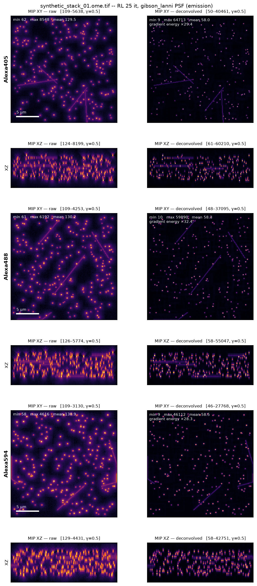

# synapse_deconv — déconvolution 3D de z-stacks confocaux (Olympus FV1000)

Pipeline Python modulaire et scriptable pour déconvoluer, canal par canal, des
z-stacks confocaux à voxel anisotrope, en vue d'une quantification de synapses.
Un seul fichier de configuration pilote tout le batch.

- **PSF théorique Gibson-Lanni** (gère le mismatch d'indice huile / milieu de
  montage), calculée sur la grille de voxels réelle du fichier.
- **Richardson-Lucy 3D** itératif, non-négativité, intensité conservée.
- **16 bits de bout en bout**, OME-TIFF calibré en sortie.
- **QC par stack** : PNG comparant les projections MIP XY et XZ avant/après,
  plus les statistiques d'intensité dans le log et dans un manifeste JSON.

---

## 1. Installation

```bash
conda env create -f environment.yml
conda activate synapse-deconv
pip install -e .
pytest                      # 106 tests
```

Aucun runtime Java n'est nécessaire.

## 2. Prise en main

```bash
# 1. Vérifier la config et lister ce qui sera traité (ne calcule rien)
synapse-deconv check config/default.yaml

# 2. Inspecter les PSF dans Fiji avant de lancer quoi que ce soit
synapse-deconv psf config/default.yaml --out psf_preview

# 3. Traiter UN SEUL stack et regarder le QC
synapse-deconv run config/default.yaml --file mon_stack.oib

# 4. Une fois les paramètres validés, lancer le dossier entier
synapse-deconv run config/default.yaml
```

Sans installation : `python -m synapse_deconv run config/default.yaml`.

Sorties dans `results/` :

| Fichier | Contenu |
|---|---|
| `<nom>_decon.ome.tif` | Stack déconvolué, 16 bits, taille de voxel conservée |
| `qc/<nom>_decon_qc.png` | MIP XY et XZ avant/après, par canal, avec les stats |
| `psf/psf_<canal>_<hash>.ome.tif` | PSF théorique effectivement utilisée |
| `pipeline.log` | Log complet : tous les paramètres, tous les avertissements |
| `run_manifest.json` | Config intégrale, versions, stats par canal et par stack |

---

## 3. Choix des bibliothèques

| Besoin | Retenu | Pourquoi pas les alternatives |
|---|---|---|
| Lecture .oib/.oif | **oiffile** (Gohlke) | Python pur, pas de JVM. `bioio` / `python-bioformats` imposent un runtime Java, fragile en batch et sur cluster |
| PSF Gibson-Lanni | **implémentation interne** (`psf.py`) | `flowdec` exige TensorFlow 1.x, incompatible Python 3.11 et non maintenu depuis 2019. Le paquet `psf` de Gohlke implémente Richards-Wolf mais **pas** Gibson-Lanni : il ne modélise ni le mismatch d'indice ni l'épaisseur de lamelle, c'est-à-dire précisément ce qui vous intéresse avec un objectif à huile |
| Richardson-Lucy | **implémentation interne** (`deconvolution.py`) | `RedLionfish` dépend de PyOpenCL. `skimage.restoration.richardson_lucy` ne permet ni de choisir le padding des bords (source classique de liserés lumineux), ni un backend GPU, ni le suivi de convergence |
| Sortie | **tifffile** | Référence pour l'OME-TIFF |

Le cœur numérique ne dépend donc que de **numpy + scipy + tifffile**, ce qui
maximise la reproductibilité à long terme. Le backend GPU (CuPy) est détecté
automatiquement s'il est présent, sans changer la configuration.

---

## 4. Physique de la PSF

`OPD(ρ)` est l'écart de chemin optique à travers la pupille :

```
OPD(ρ) =  ns ·zp       · √(1 − (NA·ρ/ns )²)     ← échantillon
        + ni ·(ti0 + z)· √(1 − (NA·ρ/ni )²)     ← immersion (porte la défocalisation)
        − ni0·ti0      · √(1 − (NA·ρ/ni0)²)
        + ng ·tg       · √(1 − (NA·ρ/ng )²)     ← lamelle
        − ng0·tg0      · √(1 − (NA·ρ/ng0)²)
```

et la PSF est le module carré de la transformée de Hankel
`h(r,z) = |∫₀¹ J₀(k·NA·r·ρ)·exp(i·k·OPD)·ρ dρ|²`.

Trois points qui font la différence sur des données réelles :

**Au-delà de l'angle critique.** Avec NA = 1.40 et un milieu à n = 1.33,
`NA/ns > 1` : les racines carrées deviennent imaginaires. Elles sont évaluées
dans le plan complexe, ce qui rend ces contributions évanescentes (décroissantes)
au lieu de les faire diverger — c'est le comportement physique correct.

**Recentrage du noyau.** En présence de mismatch, l'émetteur situé à la
profondeur `zp` n'est pas au point à `z = 0` mais à `z₀ = −zp·ni/ns` (le terme
quadratique du développement de l'OPD s'y annule). Le noyau est échantillonné
autour de `z₀`. Comme `z₀` ne dépend pas de la longueur d'onde, **les trois
canaux subissent exactement le même décalage** : leur recalage axial relatif —
ce dont dépend une mesure de colocalisation — est préservé. Le résidu est de
l'aberration sphérique chromatique réelle, et il est journalisé.

**Sur-échantillonnage.** À 0,095 µm/pixel le cœur de la PSF ne fait que ~2
pixels. Chaque voxel est moyenné sur une sous-grille `oversample_xy²` pour
éviter l'aliasing.

### Validation

Cas sans aberration (`sample_ri = immersion_ri`, `particle_depth_um = 0`), à
λ = 519 nm, NA = 1,40, n = 1,515 :

| Grandeur | Mesuré | Théorie |
|---|---|---|
| FWHM latérale | 0,190 µm | 0,189 µm (`0,51·λ/NA`) |
| FWHM axiale | 0,511 µm | 0,490 µm (exact non-paraxial) |

> La formule scolaire `1,77·n·λ/NA² = 0,71 µm` est une **approximation
> paraxiale** : à NA 1,40 (α = 67°) elle surestime la FWHM axiale d'environ 45 %.
> La valeur exacte se calcule avec `u = 8π·n·z·sin²(α/2)/λ`. Ne l'utilisez pas
> comme référence pour juger la PSF.

---

## 5. Ce qui a été mesuré sur un stack test

Stack synthétique 3 canaux × 30 × 256 × 256, voxel (0,30 ; 0,095 ; 0,095) µm,
puncta convolués par la vraie PSF puis bruités (Poisson + lecture), vérité
terrain connue. Richardson-Lucy, 25 itérations, PSF Gibson-Lanni.

| Canal | FWHM latérale | FWHM axiale | Intensité totale |
|---|---|---|---|
| 421 nm | 0,159 → **0,107 µm** | 0,489 → **0,312 µm** | ×0,996 |
| 519 nm | 0,207 → **0,117 µm** | 0,575 → **0,322 µm** | ×0,995 |
| 617 nm | 0,244 → **0,133 µm** | 0,651 → **0,346 µm** | ×0,993 |

Gain de résolution d'un facteur 1,8 à 1,9 dans les deux directions, et
l'intensité totale est conservée à 0,5 % près — ce qui est la propriété qui rend
les intensités de puncta comparables entre images.

Reproduire :

```bash
python scripts/make_test_stack.py --out data/raw --save-truth
mv data/raw/*_truth.ome.tif data/truth/
synapse-deconv run config/default.yaml --file synthetic_stack_01.ome.tif --intensity-scale 0.45
python scripts/validate_against_truth.py \
    --raw data/raw/synthetic_stack_01.ome.tif \
    --decon results/synthetic_stack_01_decon.ome.tif \
    --truth data/truth/synthetic_stack_01_truth.ome.tif \
    --intensity-scale 0.45
```



---

## 6. Trois pièges à connaître avant de lancer le batch

### 6.1 Le clipping à 65535 (le plus important)

Richardson-Lucy **concentre** les photons d'un punctum sur beaucoup moins de
voxels : le pic monte d'un ordre de grandeur. Un stack brut culminant à 8 500
coups peut ressortir à 121 000, donc écrêté à 65 535 — et les puncta les plus
brillants deviennent inutilisables pour une mesure d'intensité.

Le pipeline le détecte, le compte, et propose le facteur à appliquer :

```
WARNING 93 voxel(s) (0.0047%) exceeded 65535 and were clipped; peak was 121006.0.
        Set output.intensity_scale to <= 0.487 (the SAME value for every image
        of the study) to keep the full dynamic range.
```

**Procédure** : lancer 2-3 stacks représentatifs (les plus brillants), relever la
valeur suggérée la plus basse, la fixer dans `output.intensity_scale`, puis
relancer tout le batch avec cette valeur unique. Un gain constant préserve la
comparabilité entre groupes ; `bit_depth_policy: rescale_per_stack` ne la
préserve **pas** et n'est là que pour l'affichage.

### 6.2 L'offset du PMT

Richardson-Lucy suppose un bruit de Poisson pur, donc un fond nul. L'offset du
détecteur (typiquement 50-150 coups sur un FV1000) est traité comme du signal et
« déconvolué » lui aussi, ce qui laisse un voile résiduel. Sur le stack test,
avec un offset de 100 coups :

| `background.method` | Fond résiduel après déconvolution |
|---|---|
| `none` (défaut) | 109 coups |
| `constant`, `constant_value: 100` | **4,4 coups** |

Mesurez votre offset sur une zone sans marquage (ou sur une acquisition laser
éteint) et mettez-le en dur dans `constant_value`. Une valeur fixe reste
identique pour toutes les images, contrairement à `percentile` qui l'estime
image par image et introduit une variabilité inter-image.

### 6.3 L'échantillonnage à 421 nm

À 0,095 µm/pixel, le critère de Nyquist pour le canal 421 nm demande 0,0917 µm :
vous êtes **très légèrement sous-échantillonné** sur ce canal. `check` le
signale. Ce n'est pas bloquant, mais aucune déconvolution ne restitue une
information qui n'a pas été acquise ; si ce canal est critique, montez le zoom
d'un cran à l'acquisition.

---

## 7. Reproductibilité

- **Empreinte de configuration** : hash des seuls paramètres qui modifient les
  valeurs de pixels (optique, PSF, canaux, déconvolution, fond, gain de sortie).
  Déplacer le dossier de sortie ou changer le DPI du QC ne la change pas ;
  changer le nombre d'itérations, si. Elle est écrite dans le log, dans le
  manifeste et dans l'en-tête OME du fichier de sortie.
- **PSF identiques** pour tous les stacks d'un même batch (mises en cache par
  hash de paramètres) ; le manifeste permet de vérifier que deux stacks de deux
  groupes différents ont bien reçu exactement la même PSF.
- **Déterminisme** : aucun tirage aléatoire, aucune estimation par image quand
  `background.method` vaut `none` ou `constant`. Deux exécutions donnent des
  fichiers bit-à-bit identiques (couvert par les tests).
- **Manifeste** : `run_manifest.json` contient la config intégrale, les versions
  de Python / numpy / scipy / tifffile / oiffile, et pour chaque canal de chaque
  stack les stats avant/après, le ratio d'intensité, le nombre de voxels écrêtés
  et la clé de PSF.

---

## 8. Configuration

Tout est dans `config/default.yaml`, commenté section par section. Les
paramètres à vérifier en priorité :

| Paramètre | Défaut | À vérifier parce que |
|---|---|---|
| `optics.sample_ri` | 1.47 | Indice du milieu de montage. ProLong ≈ 1,46-1,47 ; Mowiol ≈ 1,41-1,45 ; PBS = 1,33. Pilote l'aberration sphérique |
| `optics.particle_depth_um` | 2.0 | Profondeur des synapses sous la lamelle. 2 µm pour des cultures, 5-10 µm pour des coupes |
| `channels[].emission_nm` | 421/519/617 | Doivent correspondre à vos fluorophores et à l'**ordre des canaux du fichier** |
| `output.intensity_scale` | 1.0 | Voir §6.1 |
| `background.method` | `none` | Voir §6.2 |
| `deconvolution.iterations` | 25 | Plus d'itérations = plus résolu mais plus bruité |

Options notables :

- `psf.mode: confocal` — PSF confocale complète `h_ex · (h_em ⊛ pinhole)` au lieu
  de la seule PSF d'émission. Plus fidèle au FV1000 (PSF plus étroite), demande
  les longueurs d'onde d'excitation et le diamètre du sténopé en unités d'Airy.
- `psf.model: born_wolf` — cas idéal sans mismatch, utile en comparaison.
- `deconvolution.regularization: tv` — Richardson-Lucy régularisé par variation
  totale (Dey et al. 2006), limite l'amplification du bruit au-delà de ~20
  itérations sur des stacks peu lumineux.
- `deconvolution.backend: cupy` — force le GPU (sinon `auto` le détecte).

---

## 9. Architecture

```
synapse_deconv/
  config.py          schéma de configuration, validation, empreinte
  readers.py         .oib/.oif (oiffile) et OME-TIFF, unités, normalisation des axes
  psf.py             Gibson-Lanni / Born & Wolf, mode confocal, cache disque
  deconvolution.py   Richardson-Lucy 3D FFT, backends numpy/cupy, option TV
  writers.py         OME-TIFF 16 bits calibré, politiques de conversion
  qc.py              statistiques d'intensité et figures MIP avant/après
  pipeline.py        traitement d'un stack, batch, manifeste
  cli.py             sous-commandes run / check / psf
scripts/
  make_test_stack.py          génère un stack synthétique à vérité connue
  validate_against_truth.py   mesure FWHM et conservation d'intensité
tests/                        106 tests
```

Chaque module est utilisable seul :

```python
from synapse_deconv import compute_psf, read_stack, richardson_lucy

stack = read_stack("mon_stack.oib")
psf = compute_psf(voxel_size_um=stack.voxel_size_um, emission_nm=519.0,
                  optics=optics, psf_cfg=psf_cfg)
result = richardson_lucy(stack.data[1], psf.data, iterations=25)
```

---

## 10. Gestion d'erreurs

Un stack qui échoue est journalisé et le batch continue (`processing.fail_fast:
true` pour l'inverse). Sont détectés et tracés : fichier illisible ou tronqué,
nombre de canaux incohérent avec la config, absence d'axe Z, NaN/Inf (remplacés
par 0), valeurs négatives, saturation à 65535 en entrée, écrêtage en sortie,
calibration absente ou aberrante, sous-échantillonnage, divergence de
Richardson-Lucy, et longueur d'onde du fichier en désaccord avec la config.
